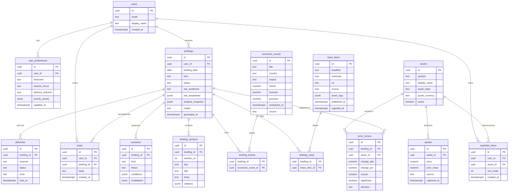

# 04 — Database Schema

**Engine:** PostgreSQL (MVP runs on an in-memory adapter with the *same* logical
model, so the schema is authoritative regardless of backing store).

Design principles:
- Every user-owned row carries `user_id` so single-user → multi-user is a config
  change, not a migration of intent.
- Briefings store both the **rendered sections** and the **analysis snapshot**
  they were generated from (full audit + future archive/vector indexing).
- Times are `timestamptz`, always UTC at rest.

## ERD (mermaid)

## Table notes

### `assets`
Reference data for the covered universe. `asset_class ∈
{fx, commodity, index, crypto}`. Seeded by migration with the MVP universe.

### `quotes`
One row per asset per ingestion run. `prev_close` is the prior-NY-close anchor
used for move detection. `source` records the provider for citation/audit.

### `price_moves`
The move-detection output, snapshotted **per briefing** (so a briefing is
reproducible). `direction ∈ {up, down, flat}`; `significant` is the threshold +
z-score decision; `zscore` is vs. recent realized vol.

### `briefings`
- `kind ∈ {morning, intraday, eod}` — only `morning` is produced in the MVP, but
  the column exists so future cadences need no migration.
- `status ∈ {pending, generating, ready, failed, delivered}`.
- `risk_sentiment ∈ {risk_on, risk_off, mixed}` from the deterministic
  classifier; `risk_breakdown` stores the component scores.
- `analysis_snapshot` (jsonb) is the full normalized input the LLM saw — the
  audit trail and the seed for future archive/vector indexing.
- `model` records which LLM (or `mock`) produced it.
- Unique on `(user_id, briefing_date, kind)`.

### `briefing_sections`
The 13 sections, one row each, ordered by `section_no`. `key` is a stable
machine key (e.g. `overnight_summary`); `citations` is an array of
`{type, ref_id, source, url}`.

### `scenarios`
Bull / Bear / Chop. `conditions` and `invalidation` are arrays of conditional
strings — never imperatives.

### `news_items` / `economic_events`
Provider-agnostic normalized feeds. Linked to briefings via the join tables so
the same item can support multiple briefings without duplication.

### `deliveries`
Audit of every delivery attempt per channel.

## Migrations
`backend/migrations/001_init.sql` creates all tables, indexes, and seeds
`assets` + a default single-user row. The in-memory adapter mirrors these shapes
exactly so behavior is identical with or without Postgres.
